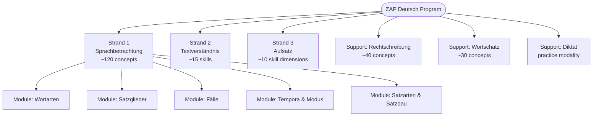
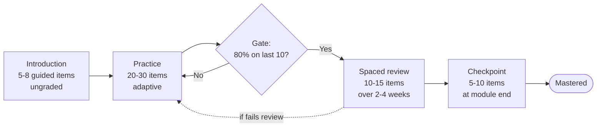
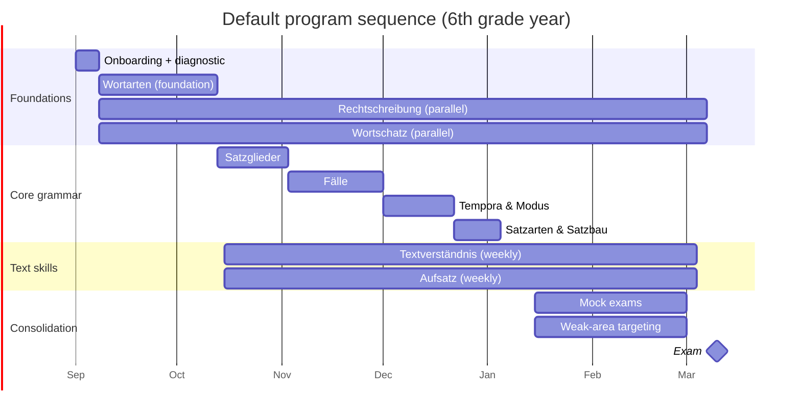
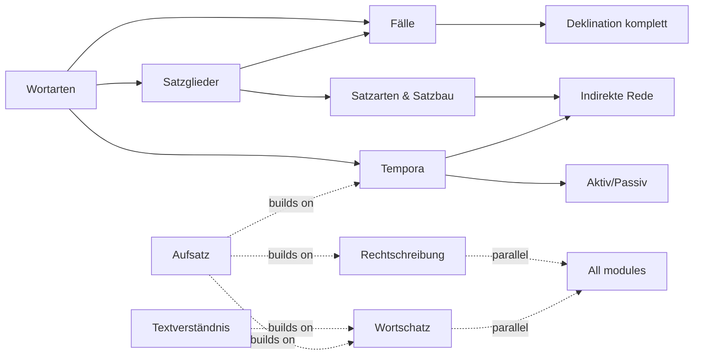

# Learning Program

*Companion to `strategy.md`, `user-flows-and-interaction.md`, and `ai-companion.md`. Defines **what** the app teaches. The AI companion doc defines **how**.*

---

## 1. Philosophy

The program is the spine of the product. Everything else — the mascot, the exercises, the parent dashboard — serves the progression through this program.

Four principles govern its shape:

**Mastery-based, not time-based.** A child advances when they demonstrate competence, not when a week passes. The program has milestones, not deadlines.

**Spaced retrieval is non-negotiable.** Content learned once and never revisited is content forgotten. Every mastered concept returns at expanding intervals (1 day, 3 days, 1 week, 2 weeks, 1 month).

**Lehrplan 21-aligned terminology.** We use the same grammatical vocabulary the Swiss school system uses, so what the child learns in our app reinforces what they hear in class. This also aligns with the dominant preparation workbooks (ZKM Verlag, "Die Sprachstarken").

**DaZ-aware scaffolding throughout.** Every concept has an L1-explanation path for the five specific linguistic confusions bilingual learners face: gender assignment (der/die/das), case system (accusative vs. dative), tense logic (Perfekt vs. Präteritum), word order (verb-second, verb-final in subordinate clauses), and separable verbs. These are the five pain points. Each surfaces repeatedly in the program.

### How the program relates to the AI

The program defines the **what**: every concept that needs to be taught, practiced, and reviewed. The AI mascot (see `ai-companion.md`) is the delivery layer — it proposes the next concept, explains it conversationally, generates exercises, evaluates responses, and handles off-program questions ("was ist eigentlich Konjunktiv?") without losing the plot.

Kids never see the program structure as a menu to navigate. They see it through the mascot's proposals: *"Heute schauen wir uns zusammen die vier Fälle an — bereit?"*

---

## 2. Program hierarchy

The program is a five-level tree. Each level has precise meaning.

```
Domain     →  Sprachbetrachtung (the whole grammar area)
  Module   →  Wortarten (a coherent grammatical topic)
    Unit   →  Nomen (one part of speech)
      Concept →  Genus bestimmen (one atomic skill)
        Exercise →  one practice item
```

**Concept is the atomic unit of progress.** Everything in the mastery model, the dashboard, the AI's proposal logic, hinges on concepts. There are approximately 220 concepts in the full ZAP Deutsch program (detailed below).

**Mastery criteria per level:**

| Level | Mastery criterion |
|---|---|
| Concept | 80% correct on the last 10 attempts + 85% retention on spaced review after 14 days |
| Unit | All concepts in the unit reach mastery |
| Module | All units in the module reach mastery + checkpoint assessment passed (80% on mixed items) |
| Domain | All modules mastered + domain-level mock exam passed (75%) |
| Program | All domains mastered + full ZAP mock exam passed (the target is set at 75% correct, above the historical cut score) |

---

## 3. ZAP Deutsch curriculum — top-level map

The ZAP Deutsch exam (Langgymnasium) has three assessed strands and two supporting strands.



**Rationale for the split:**

- **Sprachbetrachtung** carries the heaviest concept count because it's the most testable and the most learnable via distributed practice. Grammar rules compose; each unit unlocks the next.
- **Textverständnis** has fewer named "concepts" but each takes much longer per attempt (a reading passage is a 10–15 minute engagement, not a 20-second grammar item).
- **Aufsatz** is scored by practice-pieces produced, not by exercise count. The unit of mastery is the essay itself.
- **Rechtschreibung** supports Sprachbetrachtung (case endings, verb forms) and Aufsatz (spelling inside the kid's writing).
- **Wortschatz** cuts across all other strands — vocabulary extends the kid's capacity everywhere.
- **Diktat** is not an exam format for Langgymnasium ZAP1 but is an efficient practice modality for orthography and listening comprehension. Treated as a supporting drill, not a core path.

---

## 4. Module-by-module curriculum

### 4.1 Sprachbetrachtung

**Module: Wortarten (parts of speech)**

The foundation. Without Wortarten the kid cannot do Satzglieder, Fälle, or any grammatical analysis. Taught first in the default sequence.

| Unit | Core concepts | Concept count |
|---|---|---|
| Nomen | Nomen erkennen; Genus (der/die/das); Numerus (Singular/Plural); Deklination Grundzüge | 5 |
| Verb | Verb erkennen; Infinitiv/finite Form; Person & Numerus; Trennbare Verben; Modalverben | 6 |
| Adjektiv | Adjektiv erkennen; Adjektiv vs. Adverb; Steigerung; Deklination Grundzüge | 5 |
| Artikel | Bestimmter/unbestimmter Artikel; Artikel und Genus; Nullartikel | 3 |
| Pronomen | Personalpronomen; Possessivpronomen; Reflexivpronomen; Demonstrativpronomen; Relativpronomen; Interrogativpronomen; Indefinitpronomen | 7 |
| Präposition | Präposition erkennen; Präposition + Fall (feste Rektion) | 3 |
| Konjunktion | nebenordnend vs. unterordnend; häufige Subjunktionen | 3 |
| Adverb | Adverb erkennen; Adverb vs. Adjektiv; Ort/Zeit/Art/Grund | 3 |
| Zahlwort & Interjektion | Kurzbehandlung | 2 |
| **Module total** |  | **37 concepts** |

Exercise budget at 40 attempts per concept: **~1,500 attempts** for the Wortarten module.

**Module: Satzglieder (sentence constituents)**

Requires Wortarten mastery (specifically Nomen, Verb, Präposition).

| Unit | Core concepts | Concept count |
|---|---|---|
| Subjekt | Subjekt finden (wer/was-Frage); Subjekt in Nebensätzen | 2 |
| Prädikat | einteiliges Prädikat; mehrteiliges Prädikat (Hilfsverb + Partizip; Modalverb + Infinitiv); trennbare Verben im Satz | 4 |
| Objekt | Akkusativobjekt; Dativobjekt; Genitivobjekt; Präpositionalobjekt | 4 |
| Adverbiale Bestimmung | Ort; Zeit; Art & Weise; Grund | 4 |
| Attribut | Adjektivattribut; Genitivattribut; Präpositionalattribut; Relativsatz als Attribut | 4 |
| Umstellproben & Ersatzproben | Satzgliedgrenzen prüfen | 2 |
| **Module total** |  | **20 concepts** |

Exercise budget: **~800 attempts**.

**Module: Fälle (cases)**

Requires Wortarten (Artikel, Pronomen) and Satzglieder (Objekt). The hardest module for bilingual learners from non-case-marked languages (English, Italian, Portuguese). For L1-Russian/Ukrainian kids, easier (cases exist) but mapping differs.

| Unit | Core concepts | Concept count |
|---|---|---|
| Nominativ | Nominativ erkennen; Nominativ als Subjekt | 2 |
| Akkusativ | Akkusativ erkennen (wen/was); Akkusativobjekt; Akkusativ nach festen Präpositionen; Wechselpräpositionen (Richtung) | 4 |
| Dativ | Dativ erkennen (wem); Dativobjekt; Dativ nach festen Präpositionen; Wechselpräpositionen (Ort); Dativ-Verben (helfen, danken, …) | 5 |
| Genitiv | Genitiv erkennen (wessen); Genitivattribut; Genitiv nach Präpositionen | 3 |
| Deklination komplett | Artikel + Adjektiv + Nomen richtig flektieren | 2 |
| **Module total** |  | **16 concepts** |

Exercise budget: **~800 attempts** (higher per-concept count due to difficulty, ~50/concept).

**Module: Tempora & Modus (tenses & mood)**

| Unit | Core concepts | Concept count |
|---|---|---|
| Präsens | Präsens bilden; starke/schwache Verben; unregelmäßige Präsensformen | 3 |
| Präteritum | Präteritum bilden; starke vs. schwache Verben; häufige unregelmäßige Formen | 3 |
| Perfekt | Perfekt bilden; Hilfsverb wählen (haben/sein); Partizip II | 3 |
| Plusquamperfekt | Bildung und Verwendung | 1 |
| Futur | Futur I (und kurz Futur II) | 2 |
| Modus | Indikativ vs. Imperativ; Konjunktiv I (indirekte Rede, Grundzüge); Konjunktiv II (Irrealis, Grundzüge) | 4 |
| Aktiv / Passiv | Passiv erkennen; Passiv bilden (Vorgangspassiv) | 2 |
| **Module total** |  | **18 concepts** |

Exercise budget: **~700 attempts**.

**Module: Satzarten & Satzbau**

| Unit | Core concepts | Concept count |
|---|---|---|
| Satzarten | Aussage-, Frage-, Aufforderungssatz; Ausrufesatz | 2 |
| Hauptsatz / Nebensatz | Hauptsatz erkennen; Nebensatz erkennen; Verbstellung (V2, V-letzt) | 3 |
| Satzverbindung | Satzreihe (Parataxe); Satzgefüge (Hypotaxe); Konjunktionalsätze; Relativsätze; indirekte Fragesätze | 5 |
| Direkte / indirekte Rede | Zeichensetzung direkter Rede; Umwandlung direkt → indirekt | 2 |
| **Module total** |  | **12 concepts** |

Exercise budget: **~500 attempts**.

**Sprachbetrachtung domain total: 103 concepts, ~4,300 attempts budget.**

### 4.2 Rechtschreibung

| Unit | Core concepts | Concept count |
|---|---|---|
| Groß-/Kleinschreibung | Nomen & Nominalisierungen; Satzanfänge; Eigennamen; Anredepronomen | 4 |
| Doppelkonsonanten & Schärfung | kurze Vokale; Doppelkonsonanten-Regel; Ausnahmen | 3 |
| Dehnung | Dehnungs-h; Doppelvokal; ie-Regel | 3 |
| s-Laute | s / ss / ß (für CH: mit Hinweis, dass ß in CH nicht verwendet wird) | 2 |
| das / dass | Artikel/Pronomen vs. Konjunktion | 2 |
| Homophone | seid/seit; wider/wieder; Tod/tot; Ähnliche | 5 |
| Zeichensetzung | Komma bei Aufzählung; Komma bei Nebensätzen; Komma bei wörtlicher Rede; Komma bei Infinitiv mit zu; Gedankenstrich, Doppelpunkt | 5 |
| Fremdwörter | Grundmuster (ph, rh, th); häufige Fremdwörter | 2 |
| Silbentrennung | Grundregeln | 1 |
| **Module total** |  | **27 concepts** |

Exercise budget: **~1,100 attempts**. Practiced alongside Sprachbetrachtung throughout the program, not sequenced as one block.

### 4.3 Wortschatz

| Unit | Core concepts | Concept count |
|---|---|---|
| Wortbildung | Komposita; Präfixe; Suffixe; Ableitungen | 4 |
| Wortfelder | Synonyme; Antonyme; Oberbegriffe / Unterbegriffe | 4 |
| Redewendungen & Metaphern | häufige Redewendungen; Sprichwörter; bildliche Sprache | 3 |
| Stilebenen | Umgangssprache vs. Standardsprache; Register erkennen | 2 |
| Homonyme & Polysemie | Wörter mit mehreren Bedeutungen; Kontext | 2 |
| Fremdwörter im Kontext | Bedeutung aus Kontext erschließen | 1 |
| **Module total** |  | **16 concepts** |

Exercise budget: **~500 attempts** (Wortschatz concepts need fewer attempts — they're exposure-based, not rule-based).

**High-DaZ value:** this module is where bilingual kids can make huge gains, because their school exposure is narrower than their peers'. Design specifically offers "vocabulary walks" — 5-minute topic explorations led by the mascot.

### 4.4 Textverständnis

Textverständnis is measured in *skills*, not concepts, because the unit of practice is a full reading passage with questions — 10–15 minutes per attempt.

| Skill | Description | Target attempts |
|---|---|---|
| Hauptaussage finden | Identify the main idea of a text | 20 |
| Details erschließen | Answer detail questions accurately | 30 |
| Wortbedeutung aus Kontext | Infer word meanings from context | 20 |
| Schlussfolgerungen ziehen | Make inferences (explicit + implicit) | 25 |
| Textstruktur erkennen | Identify text structure, paragraph function | 15 |
| Sachtext vs. literarischer Text | Distinguish text types and apply appropriate reading strategies | 15 |
| Perspektive & Erzählhaltung | Identify narrator, perspective | 10 |
| Intention erkennen | What is the author trying to do? | 15 |
| **Skill total** |  | **~150 passage-readings** |

A "passage" in this module typically takes 10–15 minutes, so the total time budget is **25–35 hours** across preparation. About one passage per three days during the build phase.

**DaZ accommodation:** bilingual kids can toggle L1-pre-reading: a 2-sentence summary of the passage in their L1 before they read the German. This is not a crutch — it primes schema, which is what good readers do naturally. Removed in mock-exam mode.

### 4.5 Aufsatz

Aufsatz is measured in *essays produced*, with each essay evaluated on four dimensions mirroring the ZAP correction schema.

| Dimension | What it assesses |
|---|---|
| Aufbau | Structure: Einleitung, Hauptteil, Schluss; paragraphing; logical flow |
| Sprache | Sentence variety; word choice; register appropriateness |
| Rechtschreibung | Spelling, capitalization, punctuation |
| Inhalt & Spannung | Content richness, narrative tension, character development, originality |

**Practice structure:**

| Phase | Activity | Count |
|---|---|---|
| Mini-exercises | Single-dimension drills (e.g., "write a tension-building paragraph from this setup") | 30 |
| Guided essays | Full essays with AI co-writing (oral planning, draft, feedback loop) | 8 |
| Independent essays | Full essays written without mid-draft AI help, then reviewed | 6 |
| Mock-exam essays | Timed, no help, under exam conditions | 4 |
| **Total** |  | **~30 mini-drills + 18 essays** |

**Essay prompts** come from three sources:

1. **ZAP archive** — real past prompts from the publicly available 10-year archive
2. **AI-generated** — new prompts calibrated to age-appropriate themes and ZAP conventions
3. **Kid's choice** — if the child wants to write about something specific, the mascot adapts

This is the most DaZ-critical strand. Bilingual kids are narratively capable but technically imprecise. The four-dimension feedback scheme lets us separate "your story is great" (affirming content) from "your tense usage needs work" (specific technical feedback).

### 4.6 Diktat (supporting, not core)

Not tested in ZAP1 Langgymnasium, but retained as a supporting practice format for:

- Rechtschreibung reinforcement (listening → writing)
- Listening comprehension for DaZ learners
- Hochdeutsch exposure (not Swiss German)

**Structure:** 20 short dictation pieces (~80–150 words each), calibrated by difficulty. Read aloud by a native Hochdeutsch voice, kid writes, AI scores spelling and punctuation. Weekly cadence optional.

### Grand totals

| Strand | Concepts / Skills | Attempts / Pieces |
|---|---|---|
| Sprachbetrachtung | 103 concepts | ~4,300 attempts |
| Rechtschreibung | 27 concepts | ~1,100 attempts |
| Wortschatz | 16 concepts | ~500 attempts |
| Textverständnis | 8 skills | ~150 passage-readings |
| Aufsatz | 4 dimensions | ~30 drills + 18 essays |
| Diktat | — | ~20 pieces |
| **Grand total** | **~160 distinct teachables** | **~6,000 practice events + 150 passages + 18 essays + 20 diktats** |

**What this means for a real kid.** This is the full program capacity, not a required path. A typical bilingual kid completing ~25 weeks of preparation at 75 min/week (≈31 hours, plus peak cramming of 20+ hours) will attempt ~1,500–3,000 practice items from this library — the adaptive algorithm concentrates attempts where the child is weakest. The rest of the library is available as spaced review, remediation, and for faster learners who outpace the default plan.

---

## 5. Exercise taxonomy

Every exercise in the program belongs to one of five cognitive types and one of six presentation formats. The AI mascot picks the combination appropriate for the concept and the current phase of mastery.

**Cognitive types** (ordered by increasing difficulty):

1. **Recognition** — "Is this a Nomen? Yes or no." Easiest; used in introduction phase.
2. **Classification** — "Which Wortart is this word? Choose one of six." Core practice type.
3. **Generation** — "Write a sentence using a Dativobjekt." Harder; requires producing, not just selecting.
4. **Transformation** — "Rewrite this sentence in Präteritum." Tests rule application on arbitrary input.
5. **Application in context** — "In this paragraph, find all Akkusativobjekte." Tests skill in a naturalistic text — this is what the exam actually tests.

**Presentation formats:**

| Format | Good for | Example |
|---|---|---|
| Multiple choice | Recognition, classification | Tap the correct Wortart from 4 options |
| Fill-in-the-blank | Transformation, application | Complete the sentence with the right Dativform |
| Tap-to-mark | Application in context | Tap all verbs in the passage |
| Drag-and-drop | Classification, ordering | Sort words into Wortart boxes; order sentence parts |
| Voice answer | Recognition, classification, conversational | Say the Wortart aloud |
| Free text | Generation, transformation | Write a sentence in Passiv |

**Mixing rule at the concept level:** introduction phase uses Recognition + MC/tap. Practice phase uses Classification + fill-blank + voice. Mastery phase uses Application in context + free text. This keeps difficulty scaffolded without the kid noticing the staircase.

---

## 6. Exercise budget and mastery model

For every concept in the program, the mastery pipeline is:



**Target numbers per concept:**

| Phase | Items | What happens |
|---|---|---|
| Introduction | 5–8 | Mascot teaches the concept, kid tries with hints always available, no grading |
| Practice | 20–30 | Adaptive difficulty within Flow band (75–85% correct), proper scoring |
| Spaced review | 10–15 | Items resurface at 1d, 3d, 7d, 14d, 30d after initial mastery |
| Checkpoint | 5–10 | Mixed with other concepts in the module, unannounced as a "test" — just "heute machen wir einen Mix" |
| **Per-concept total** | **40–60 attempts** | **~25–45 minutes active practice over 2–4 weeks** |

**Mastery indicators visible to the kid (in mascot's voice):**
- "Wir lernen das gerade" (practicing)
- "Du kannst das schon gut" (initial mastery reached)
- "Das sitzt" (consolidated after spaced review)

**Mastery indicators in parent dashboard:**
- Progress bar per concept
- "Sitzt" flag (consolidated)
- Weak-area highlights
- Time-until-forgotten indicator (if spaced review is overdue)

---

## 7. Sequencing and pacing

### Default 25-week schedule

Aligned to the Swiss school year — starts in August/September, peaks in February before the March exam.



### Dependency graph (what must come before what)

Some concepts have hard prerequisites. The adaptive algorithm respects these even when reshuffling.



### Adaptive reordering

The default sequence is a starting point. The system reorders based on:

- **Diagnostic weak areas** — prioritize concepts the child didn't already know
- **Prerequisite gaps** — if Satzglieder struggle, back off to Wortarten review
- **Spaced-review demands** — mastered items must resurface on schedule
- **Fatigue signals** — if the child is visibly failing, switch to easier concepts; end session on a win
- **Parent priorities** — parent can flag specific areas (e.g., "teacher said weak at cases")

---

## 8. Diagnostic and placement

### Initial diagnostic

12 mixed items administered at onboarding, ~5 minutes. Items span:

- 3 Wortarten recognition items (easy, medium, hard)
- 2 Satzglieder items
- 2 Fälle items
- 2 Tempora items
- 1 Rechtschreibung item
- 1 Textverständnis short item
- 1 Wortschatz item

**The kid sees:** a learning map with lit-up areas ("hier schon stark") and dim areas ("hier lernen wir zusammen").

**The kid does not see:** a score. Scores early in the relationship create shame and reduce effort. The map metaphor reframes weakness as opportunity.

**The system learns:** initial mastery estimate per module (0 = haven't tried, 1 = starter, 2 = building, 3 = mastered). Combined with the prerequisite graph, this generates the first two weeks of the plan.

### Ongoing recalibration

Every checkpoint assessment updates module-level mastery estimates. Every 4 weeks, a brief cross-module mix (15 items) recalibrates the full picture. Results are invisible to the kid and shape the plan behind the scenes.

---

## 9. Content authoring and quality assurance

The program library is not hand-authored. Given our resource constraint (0.2 FTE expert), we use a **template-and-audit** model:

1. **Template library** (hand-authored, one-time investment): for each concept, 5–10 templated question patterns with variable slots. Example for *Genus bestimmen*: `"Welches Genus hat '{NOUN}'?"` where `{NOUN}` is drawn from a curated noun list with known gender.
2. **AI generation at runtime**: the AI fills templates with contextually appropriate content, varying difficulty and avoiding exact repetition.
3. **Expert audit**: the DaZ advisor samples ~50 generated items per week, flags issues, updates templates. Over months, the template library stabilizes.
4. **User flag-to-fix loop** (see `user-flows-and-interaction.md` flow 3.9): parents and kids can flag wrong items, feeding the audit queue.

This model means we do not need to produce 6,000 items by hand. We need to produce approximately **1,500 templates** and maintain them. Achievable with the constraint.

---

## 10. What the kid sees vs. what the system knows

A critical design principle: the program is **opaque** to the kid and **transparent** to the parent.

**Kid sees:**
- Today's plan ("heute schauen wir uns die Pronomen an")
- Progress through the current concept (mastery bar)
- A high-level skill map (lit-up / dim areas)
- Mascot's commentary on how things are going

**Kid does not see:**
- Concept IDs, module hierarchy, dependency graphs
- Exercise counts ("20 more to go" creates dread)
- Mastery percentages as numbers
- The full 25-week schedule
- Comparison to any other kid

**Parent sees:**
- The full program structure
- Per-concept mastery status
- Time-to-exam projections
- Which modules are on track, behind, ahead
- What was practiced today, this week, this month

This asymmetry is deliberate. Kids at this age are served by presence — "what am I doing right now, and is it going okay?" Parents are served by the map — "are we on track, and where do we need help?"
