# User Flows & Interaction Design

*Companion to `strategy.md`, `learning-program.md`, `ai-companion.md`, and `project-documentation.md`. Designed to be re-drawn in Figma later — see Part 7 for the Claude Code → Figma handoff.*

> **Vision reconciliation note.** This document was updated after the refinement that placed the structured learning program and the AI mascot (Leo) at the center, with photo homework help demoted from "primary hook" to "useful side-door." Flow 3.2 now shows Leo proposing the plan conversationally; flow 3.3 is Frag Leo (kid-initiated conversation), which is the second core pillar. Photo help is now flow 3.7 and reframed accordingly. If you are reading this together with earlier drafts, the new framing in `strategy.md`, `learning-program.md`, and `ai-companion.md` is authoritative.

---

## Part 1 — Foundations

### Frameworks applied

This document leans on a small set of established design frameworks rather than inventing vocabulary. Each is named explicitly so decisions can be traced to a framework rather than taste.

| Framework | Where it's applied |
|---|---|
| **Jobs-to-be-Done (JTBD)** — Christensen | Defining what the child and parent are *hiring* the app to do |
| **Hook Model** — Nir Eyal, *Hooked* | Session-level engagement loop (Trigger → Action → Variable Reward → Investment) |
| **Octalysis** — Yu-kai Chou | Gamification — ensures we use intrinsic drives, not dark patterns |
| **Self-Determination Theory (SDT)** — Deci & Ryan | Motivation architecture: autonomy, competence, relatedness |
| **Flow theory** — Csikszentmihalyi | Adaptive difficulty calibration at the exercise level |
| **Fogg Behavior Model** — B = M·A·T | Designing daily-return triggers that don't depend on willpower |
| **Pirate Metrics (AARRR)** — Dave McClure | Lifecycle instrumentation — Acquisition, Activation, Retention, Referral, Revenue |
| **Journey mapping** | Macro emotional arc across weeks and months |
| **Mermaid flowcharts** | Diagram notation — renders in GitHub, Notion, and exports cleanly to Figma |

### Personas (recap, for orientation)

From `project-documentation.md`:

- **Primary: Lera, 10–11 years old, bilingual.** Fluent in spoken German, schooled in Hochdeutsch, home language Ukrainian / English / Russian / Italian / Portuguese. Not a language beginner — missing the academic register the ZAP rewards.
- **Secondary: Olena, parent, 35–45.** Pays, installs, monitors, prints. Often does not speak German well enough to coach directly. Needs visibility without having to decode worksheets.

### Jobs-to-be-Done statements

Written in the JTBD "job story" format: *When [situation], I want to [motivation], so I can [outcome].*

**Child's jobs:**

- When I don't understand a word on my school worksheet, I want to ask someone quickly without feeling stupid, so I can finish my homework.
- When I've just had a bad Diktat, I want to practice until I feel less bad about it, so I can try again on Monday.
- When I sit down to "do Gymi practice," I want to know exactly what to do for the next 15 minutes, so I don't have to decide.
- When I finish a chunk of practice, I want to feel like I made real progress, so it was worth putting down my tablet game.

**Parent's jobs:**

- When my kid says "I did my Gymi stuff," I want to see what they actually did, so I know if it was real.
- When the teacher says my kid is behind, I want to see exactly what they're weak at, so I can decide whether to pay for a tutor.
- When I have no time this week, I want the app to keep my kid on track without me, so I don't have to feel guilty.
- When I print worksheets for the weekend, I want them to look like real Gymi exam pages, so my kid is preparing for the right thing.

These drive every screen and every notification. If a feature does not map to one of these jobs, it gets cut.

---

## Part 2 — Three Scales of Interaction

Design operates at three time scales. Each has its own loop, its own metrics, and its own failure modes.

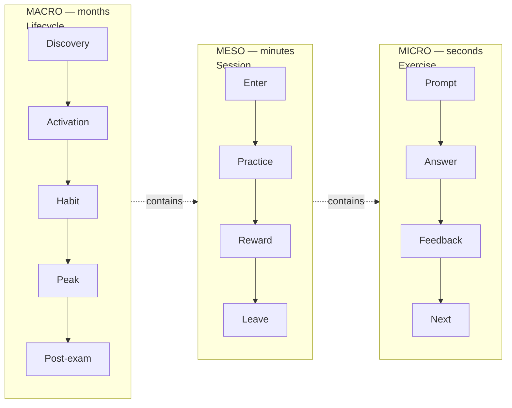

### Scale 1 — Micro: the exercise (seconds)

The atomic unit. An exercise is *one* prompt–answer–feedback cycle. Exercises compose upward:

- **Exercise** — single item (one Wortart identification, one Diktat sentence, one essay paragraph suggestion)
- **Chapter** — 6–12 exercises on one sub-topic (e.g., *Artikel bestimmen*, *Präteritum erkennen*)
- **Block** — mastery unit across related chapters (e.g., *Wortarten gesamt*, *Textverständnis Sachtext*)

**Micro loop, Flow-calibrated:**

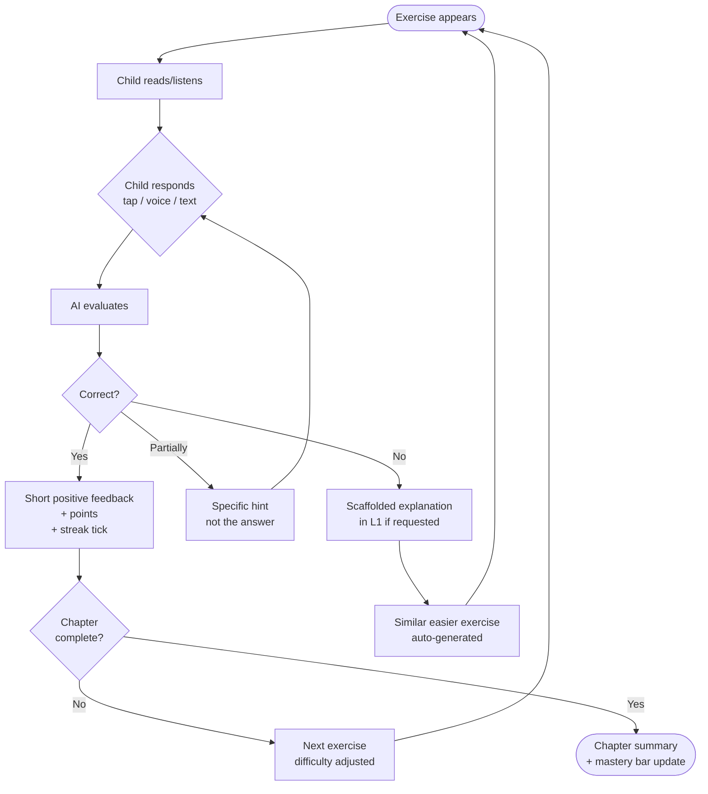

**Flow calibration rule:** target 75–85% correctness across a chapter. Below 70% → ease up. Above 90% → step up. This is the Csikszentmihalyi band where learning feels challenging but not punishing.

**Failure modes to avoid at this scale:**

- Giving the answer too fast on "wrong" (kills learning, kills competence signal)
- Generic praise ("Great job!") — kids sniff this out by age 8
- Punishment animations or red crosses — shame kills return rate

### Scale 2 — Meso: the session (minutes)

A session is one continuous use of the app. Target shape:

| Session type | Target length | Trigger | Shape |
|---|---|---|---|
| **Daily habit (program-led)** | 10–15 min | Scheduled notification after school | Leo proposes plan, 1–2 chapters, ends on a win |
| **Frag Leo** | 2–10 min | Kid has a question or curiosity | Ask → Leo explains → practice offer → often becomes a mini-chapter |
| **Aufsatz co-writing** | 20–30 min | Parent- or self-initiated on weekends | Voice planning → draft → 4-dimension feedback |
| **Five-minute window** | 2–5 min | Kid bored on tram, opens app spontaneously | Single-chapter quick practice, "Blitz-Modus" led by Leo |
| **Homework help** | 3–8 min | Child photographs a worksheet | Photo → Leo identifies task → explanation or hint or similar practice |
| **Mock exam** | 60–90 min | Parent-scheduled, periodic | Printable paper, timed, self-submitted via photo |

**Session loop, Hook Model applied:**

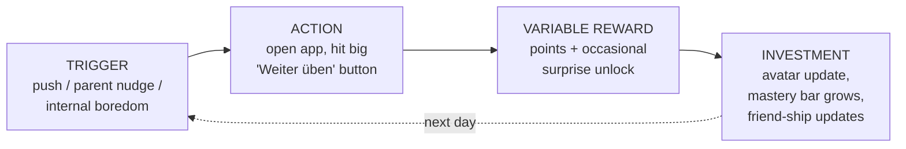

**Session opening principle:** when the app is opened, never show a menu first. Show a single primary action — "Weiter" / "Continue where you left off" — with one secondary path ("Hausaufgabe scannen"). Decision fatigue is the number-one reason kids close apps.

**Session closing principle:** always close on a win. The last exercise before a session ends should be inside the kid's competence range. Never end on a fail. If the algorithm sees the kid missing three in a row, it inserts an easy one before letting them leave.

### Scale 3 — Macro: the lifecycle (months)

The full user lifecycle maps to AARRR plus a Swiss-Gymi-specific "Peak and Post-Exam" phase.

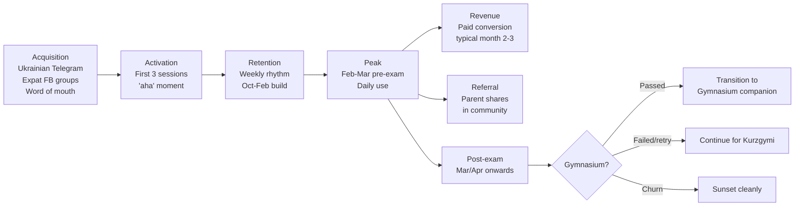

Lifecycle details in Part 5.

---

## Part 3 — Core User Flows

Each flow is shown as a Mermaid diagram plus a short narrative. Flows are written so Claude Code can later expand each node into a wireframe.

**Flow hierarchy.** The numbering reflects priority order:

- **3.1** — Onboarding (foundational — without this, nothing works)
- **3.2** — Daily habit / program-led session (the core recurring interaction)
- **3.3** — Frag Leo / conversational Q&A (the second core pillar)
- **3.4** — Voice practice (modality that supports 3.2 and 3.3)
- **3.5** — Aufsatz co-writing (highest-value single feature for bilingual kids)
- **3.6** — Stuck-on-exercise escalation (micro-flow inside 3.2)
- **3.7** — Photo homework help (useful side-door, not central)
- **3.8** — Parent discovery → activation → paid conversion
- **3.9** — Parent weekly dashboard check-in
- **3.10** — Quality concern / AI error flag

### 3.1 — Child flow: First-time onboarding (with parent)

This is the single most important flow in the product. If we lose the family here, nothing else matters.

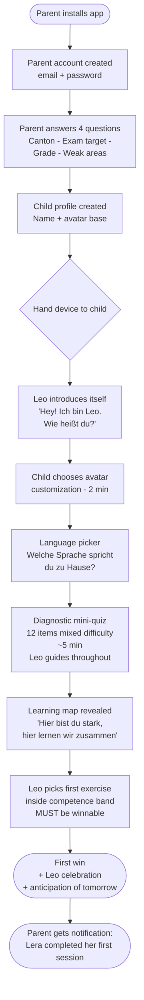

**Critical design decisions:**

- **Split responsibility deliberately.** Parent does the administrative heavy-lifting (4 questions, account). Child does the fun parts (avatar, meeting Leo, the diagnostic game).
- **No login for child.** Profile-switch from a parent-held account. Simpler for kids, safer for Apple kids-app review.
- **Leo introduces itself before anything else.** The very first interaction is the mascot saying hello and asking the kid's name. This frames everything that follows as a conversation with a companion, not as a test.
- **Diagnostic framed as a map, not a test.** Showing a "score" first triggers shame for kids who already feel behind. Showing a map of "hier bist du stark, hier können wir zusammen üben" frames the app as an ally. Diagnostic details are defined in `learning-program.md` §8.
- **First session must end with a genuine win.** Post-onboarding, Leo picks one exercise *inside* the competence band from the diagnostic. Success here is activation.

### 3.2 — Child flow: Daily habit session (program-led)

The returning-user path. The core loop the product is built around.

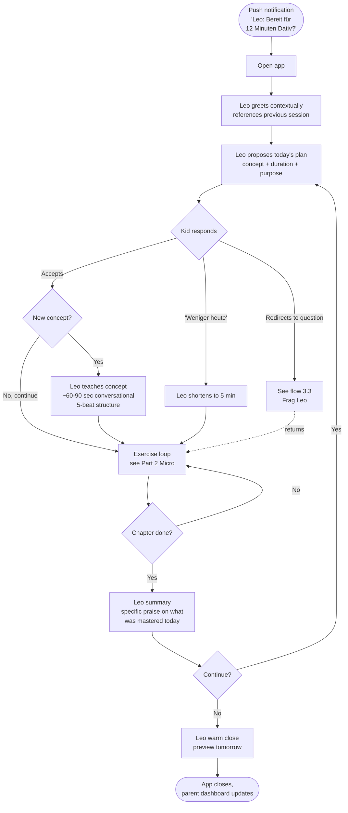

**Critical design decisions:**

- **Leo proposes, kid responds.** The kid never faces a menu of choices. Leo says *"Heute können wir zwei Sachen machen: Possessivpronomen wiederholen und ein neues Satzglied anschauen. Ungefähr 12 Minuten. Okay?"* The kid accepts, shortens, or redirects. This is autonomy-preserving without being decision-fatiguing. Sample scripts in `ai-companion.md` §5.
- **The plan comes from the program, not from a content library.** Leo knows what concept is next because `learning-program.md` defines the sequence and the spaced-review schedule. The kid does not see this complexity.
- **New-concept introductions are conversational, not tutorial screens.** When introducing something new, Leo follows a 5-beat structure (hook → name → second example → check → practice offer) across 5 short bubbles. Full detail in `ai-companion.md` §5.3 and §9.
- **Exit is celebrated, not punished.** No "are you sure?" modals. No streak-anxiety pressure. If the kid leaves after 5 minutes, that's 5 minutes of genuine practice.
- **Frag Leo is reachable without leaving the session.** Mid-practice, the kid can tap a "Frag Leo" button to ask anything. After the answer, Leo offers to return to the exercise. Flow 3.3.
- **Sessions always end on a win.** If the algorithm detects three fails in a row near session end, it inserts an easier item before closing. Described in Part 2 under "Session closing principle."

### 3.3 — Child flow: Frag Leo (conversational Q&A)

Kid-initiated conversation. The second core pillar — curiosity becomes practice.

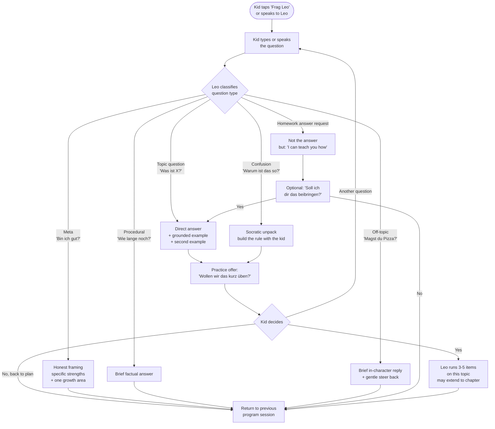

**Critical design decisions:**

- **Frag Leo is always reachable.** A persistent surface on the home screen, plus a button during any exercise, plus a deep voice trigger ("Hey Leo..."). The kid should never feel "there is no one to ask."
- **Almost every substantive answer ends with a practice offer.** Curiosity that gets answered but not practiced does not consolidate. Leo's universal pattern is answer → example → offer ("wollen wir üben?"). Details in `ai-companion.md` §7.
- **The practice that emerges from a Frag Leo question often becomes a full chapter.** This is the key design insight. A kid who asks "was ist Konjunktiv?" and gets 3 items often keeps going for 10. Curiosity-driven practice has higher completion than scheduled practice.
- **Leo refuses homework-cheating gracefully.** "Show me the answer" is redirected to "I can show you how." Parents can see in the weekly email which Frag Leo questions happened.
- **Voice is first-class in this flow.** A 10-year-old types poorly; speech is natural. Voice input with live transcription lets them correct if misheard.
- **Off-topic conversation has a two-exchange cap.** Leo engages briefly and steers back. Leo is a character, not a friend substitute. See `ai-companion.md` §1 ("What Leo is not") and §7.

### 3.4 — Child flow: Voice conversation / spoken practice

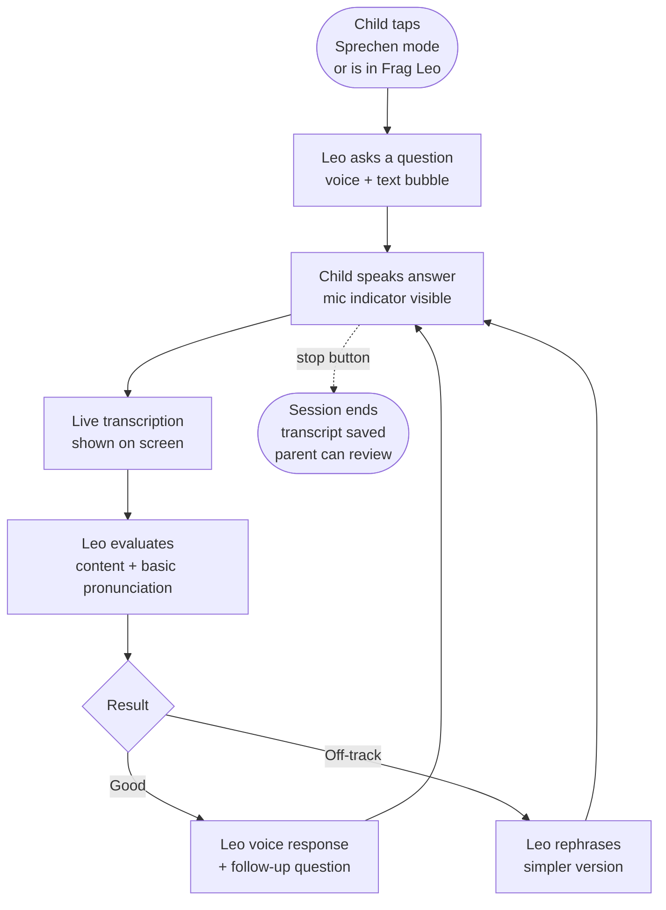

**Use cases for voice mode:**

- **Aufsatz pre-planning** (flow 3.5): child tells Leo the story, Leo helps structure it before any writing
- **Textverständnis oral practice**: Leo reads a short passage aloud, asks comprehension questions orally
- **Frag Leo by voice**: kid asks grammar questions naturally rather than typing
- **Vocabulary conversation practice** for L1-Ukrainian/Russian kids who need German expression reps

**Privacy note:** all voice stays on-device where technically feasible, otherwise encrypted in transit with a clear parent-facing statement. Kids this age cannot meaningfully consent to voice data — parents must.

### 3.5 — Child flow: Aufsatz co-writing

The Aufsatz is the hardest exam component for bilingual kids, and the single highest-value feature if done well. Designed for a 20–30 minute weekend block.

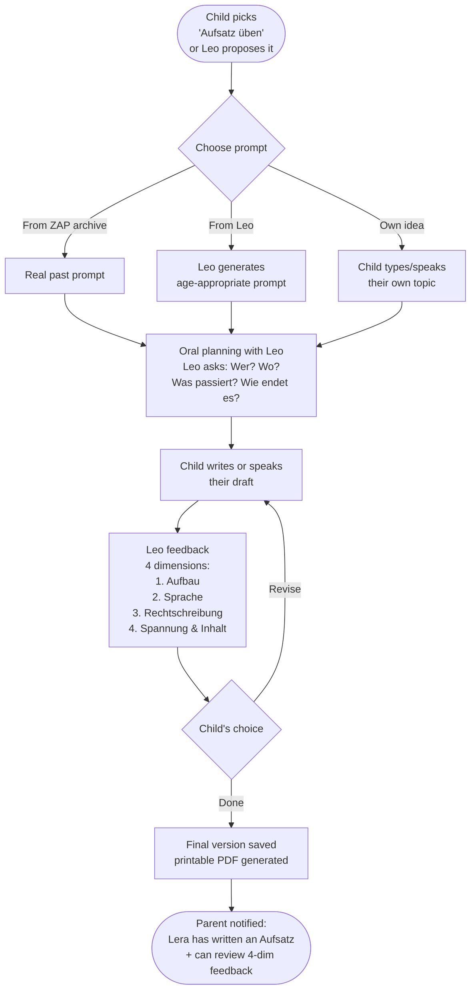

**Critical design decisions:**

- **Planning before writing.** Good teachers do this. Bilingual kids especially benefit — they have the story in their head, they need help structuring it in German before they start typing. Leo's planning phase is oral wherever possible.
- **Four-dimension feedback mirrors the ZAP correction schema.** Aufbau, Sprache, Rechtschreibung, Spannung/Inhalt. This is the rubric examiners use. Anchoring to the real rubric from day one builds trust.
- **Saved, printable, shareable.** Parents want to see the essay. Teachers want to see the essay. The printable PDF makes the AI work legible to adults who don't trust AI work.
- **Aufsatz mastery is measured in essays, not exercises.** Per `learning-program.md` §4.5, the target is ~18 full essays plus ~30 single-dimension mini-drills over the prep cycle.

### 3.6 — Child flow: Stuck-on-exercise escalation

What happens when a child is visibly failing. Governs whether the app feels like a helper or a judge.

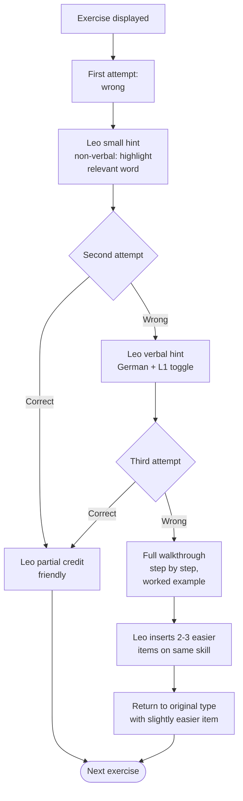

**Critical design decisions:**

- **Three tries before a walkthrough, not one.** Grit is a learned skill; we design for it.
- **Escalation is invisible.** The child should not feel "the app gave up on me and switched to baby mode." Easier items are framed as "lass uns kurz aufwärmen."
- **L1 fallback at the second hint, not the first.** German first; L1 is support, not crutch. Per-L1 explanation templates defined in `ai-companion.md` §2.

### 3.7 — Child flow: Photo homework help

A useful side-door, not the primary interaction. Kids appreciate it because it proves the app is additive to school work rather than competing with it. Parents appreciate it because they can see their kid is getting help with real school stuff. But the daily reason the kid opens the app is the relationship with Leo and progression through the program — not photo help.

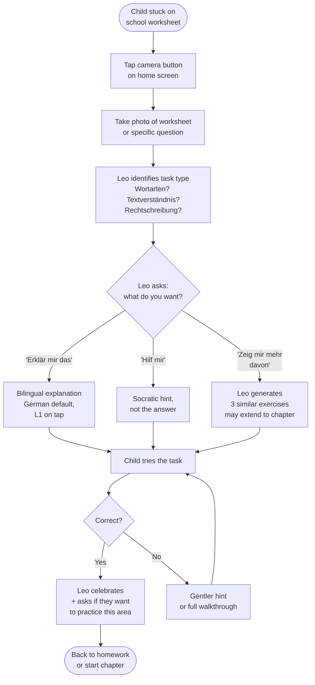

**Critical design decisions:**

- **Never just solve it.** Leo is a tutor, not a homework cheater. Parents will abandon the app the first time they suspect it gave an answer. Homework-answer detection triggers a teaching-mode redirect.
- **"Zeig mir mehr davon" is the important branch.** One scanned worksheet becomes a practice chapter, which feeds back into the program. This is how the photo feature connects to the program — not as a separate silo.
- **Photo help is additive, not central.** When building prioritization lists, feature work, marketing copy: photo help is one of several features Leo offers, not the headline. The headline is "Leo learns with your kid."

### 3.8 — Parent flow: Discovery → activation → paid conversion

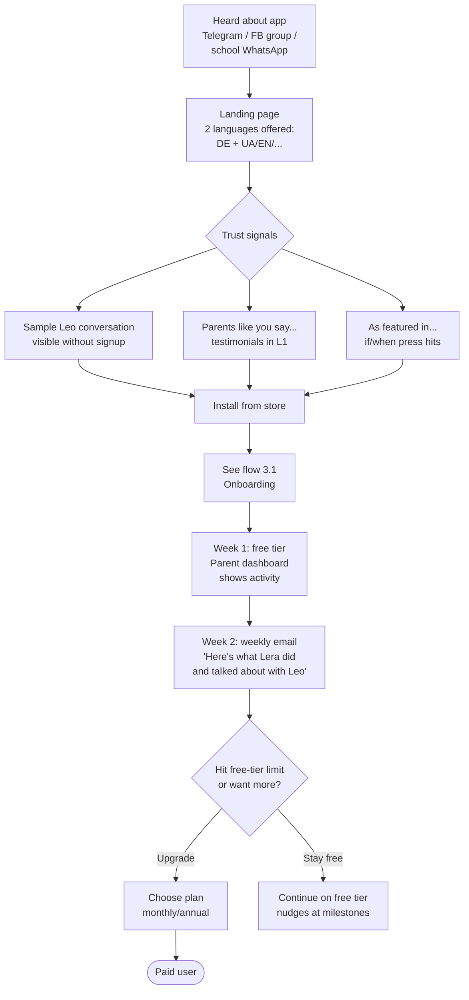

**Critical design decisions:**

- **Sample Leo conversation visible without signup.** Parents in German-speaking markets are AI-skeptical. Show them an actual Leo dialogue (like the transcripts in `ai-companion.md` §10) rendered as a live demo. That demo is the conversion moment.
- **The paid trigger is value, not friction.** We do not lock essential features. Parents upgrade when they see real progress and want more Frag Leo interactions, more mock exams, priority on essay feedback, and full printable-worksheet access.
- **Weekly email is the retention spine.** Parents forget the app exists; the email reminds them their kid has been working. It highlights what Leo and the kid talked about during the week — these are shareable moments ("Leo taught her about Konjunktiv today").

### 3.9 — Parent flow: Weekly check-in on dashboard

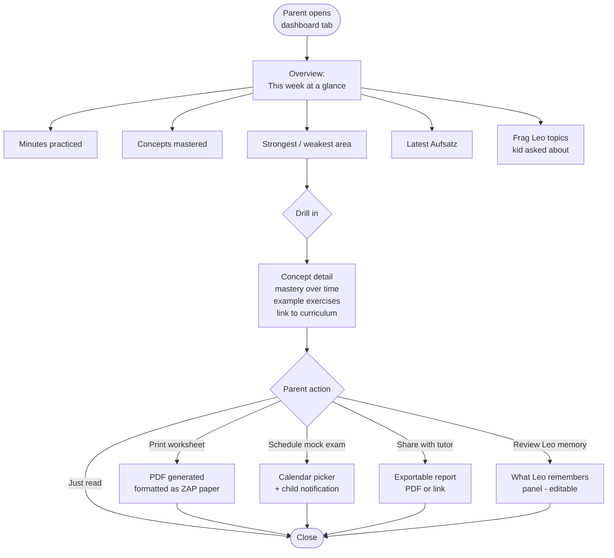

**Design principle:** the dashboard answers three questions in order of importance:

1. **Is my kid actually using this?** (minutes, last session)
2. **Are they getting better?** (mastery over time, trend line)
3. **Where are they weak?** (concept list, sortable — maps to `learning-program.md` hierarchy)

Secondary answers, one tap away: full concept tree, what Leo said today, what the kid asked about, export to tutor, memory review.

**What Leo remembers** is its own surface, per `ai-companion.md` §8. Parent can inspect the kid-level state Leo uses, delete individual elements, or reset entirely. This is the transparency lever that makes AI-skeptical parents comfortable.

### 3.10 — Parent flow: Quality concern / AI got something wrong

Inevitable. How we handle it defines our credibility.

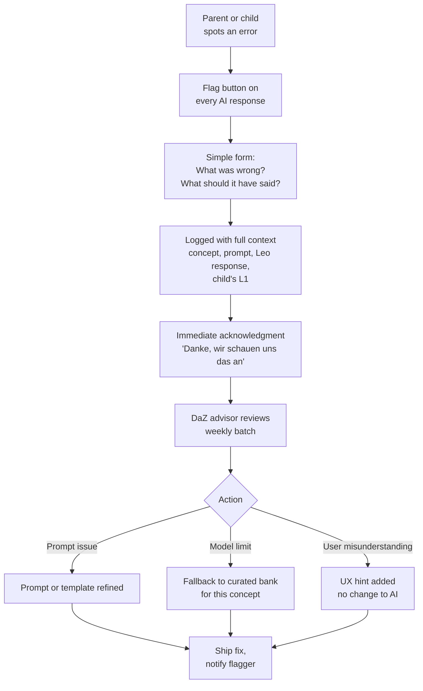

**Why this matters:** with a 0.2 FTE expert, we cannot catch every AI error ourselves. Parents are our QA team. Making the flag visible and acknowledged converts a trust-breaker into a trust-builder. This is also how the template library (`learning-program.md` §9) improves over time.

---

## Part 4 — Engagement & Retention Model

### Octalysis mapping

The Octalysis framework identifies 8 core drives for engagement. For a kids' education app, we lean heavily on the "white-hat" (intrinsic, empowering) drives and deliberately avoid the "black-hat" (compulsive, loss-driven) ones.

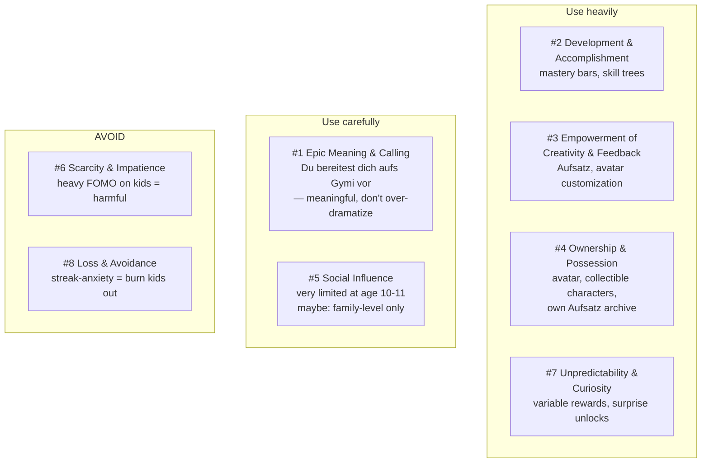

**Specific mechanics derived from this:**

| Mechanic | Octalysis drive | Behavior it creates |
|---|---|---|
| Mastery bar per skill | #2 Accomplishment | Tangible progress; kid sees the bar fill |
| Avatar customization | #3 Creativity / #4 Ownership | Identity investment; reason to return |
| Points per exercise, not per session | #2 Accomplishment | Rewards effort, not just showing up |
| Character companion (Leo) who reacts | #4 Ownership / #5 Relatedness | Emotional attachment, return trigger |
| Weekly "overraschung" — surprise unlock | #7 Curiosity | Variable reward = habit formation |
| Skill tree visible from home screen | #2 Accomplishment | Progress toward a visible goal |
| "You wrote your first Aufsatz!" milestones | #1 Meaning | Tie progress to real-world identity |
| **No** daily streak counter with fire emoji | *avoid #8* | We do not want the app to feel like a chore debt |
| **No** leaderboards against other kids | *avoid #5 dark side* | Comparison is harmful at this age, especially for bilingual kids |
| **No** time-limited sales or urgency pops | *avoid #6* | Kids cannot evaluate financial urgency |

**Soft streak, not hard streak.** We track consecutive days but never make it the primary UI. Missing a day does not "break" anything; returning after a break is celebrated ("Schön, dass du wieder da bist!"). The distinction is subtle but it is the difference between an app that serves the kid and one that uses the kid.

### Self-Determination Theory in UX

SDT says intrinsic motivation comes from three psychological needs. Our product surface must deliver all three.

| SDT need | Product manifestation |
|---|---|
| **Autonomy** — I choose | Kid picks their avatar, picks their L1, picks "Weiter" vs "Etwas anderes." Plan is suggested, never forced |
| **Competence** — I'm getting better | Flow-calibrated difficulty (75–85% correct), visible mastery bars, sessions end on wins |
| **Relatedness** — I'm with someone | Leo the character, bilingual explanations in their L1 (feels seen), parent gets updates (feels supported) |

### Hook Model applied per major surface

| Surface | Trigger | Action | Variable reward | Investment |
|---|---|---|---|---|
| **Daily program-led session** | Afternoon push ("Leo: bereit für heute?") | Accept Leo's plan proposal | Specific praise + mastery growth + occasional surprise (new Leo reaction, avatar item, concept milestone) | Deeper relationship with Leo; mastery bars grow; skill map fills in |
| **Frag Leo** | Internal curiosity, confusion, or moment of boredom | Ask a question | Quality of Leo's answer varies; often the conversation opens a new area the kid didn't expect | The kid's question history shapes what Leo references later — "remember when you asked about Konjunktiv?" |
| **Aufsatz** | Weekend time, parent nudge, or Leo proposal | Start writing | 4-dimension feedback has real variability (some strong, some needs work); Leo's reactions to the story content feel earned | Essay archive fills up; Leo references past stories ("die Katze kommt wieder?") |
| **Photo help** | Homework frustration (internal, side-door) | Tap camera | Leo's task recognition + explanation quality varies | One scan often becomes a practice chapter, feeding back into the program |
| **Parent dashboard** | Weekly email or Sunday check | Open dashboard | Sometimes big progress, sometimes modest; Frag Leo topics often surprising in a good way | Accumulated picture of child's growth; Leo memory visibility |

The two top rows — daily program-led session and Frag Leo — are the ones we invest most in. The others are lower-frequency surfaces that still earn their place.

### Daily return triggers (Fogg B=MAT)

For daily return, **Motivation × Ability × Trigger** must all be high. We engineer each:

- **Motivation** = meaningful goal (Gymi) + intrinsic drives (mastery, Leo) + social (parent cares)
- **Ability** = one-tap from notification to practicing; "Weiter" button requires no decision; sessions as short as 5 minutes are valid
- **Trigger** = push notification at a parent-set time (default: 30 min after school ends on school days; Saturday morning on weekends)

If a kid skips 3 days → different notification tone ("Leo vermisst dich"). If skips 7 days → parent email, not child push ("Lera hat eine Woche pausiert — alles okay?"). Re-engagement targets the parent, not the kid, because the parent is the agent who can make the kid return.

### What we explicitly will not do

A shortlist of dark patterns common in EdTech that we reject:

- Streak-breaks with guilt animations (Duolingo's crying owl is famously harmful for anxious kids)
- Leaderboards or public rank comparisons among students
- "Pay to revive streak" monetization
- Auto-renewing trials without clear notice
- Manipulative exit popups ("Are you sure? Leo will be sad!")
- Any advertising. Ever.
- Behavioral data resale or third-party analytics that identify the child

---

## Part 5 — Lifecycle Journey Map

Because the Swiss Gymi cycle is strongly seasonal (exam in early March), the lifecycle has a very specific shape, distinct from generic EdTech.

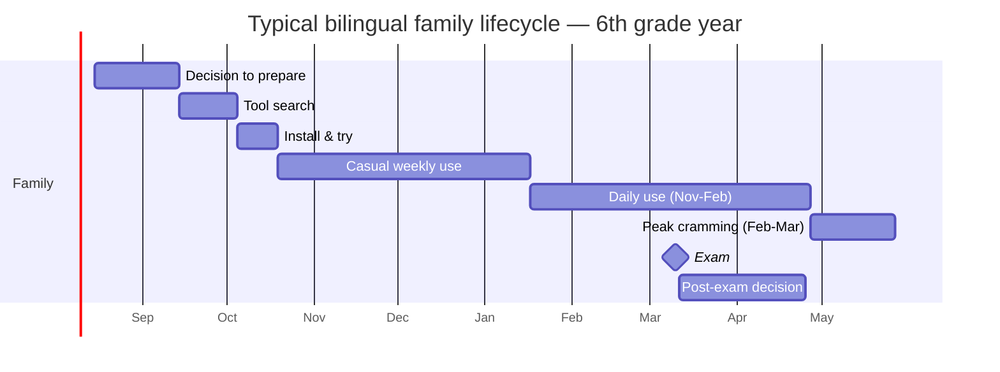

**Emotional arc by phase:**

| Phase | Parent emotion | Child emotion | Our job |
|---|---|---|---|
| **Decision (Aug–Sep)** | Anxiety, uncertainty | Mild awareness | Be findable. Landing page in their language. |
| **Tool search (Sep–Oct)** | Comparison shopping | Indifferent | Demonstrate value without signup. Show sample AI output. |
| **Install & try (Oct)** | Skeptical optimism | Curious | Onboarding flow 3.1 must deliver a real "aha" in first 10 minutes. |
| **Casual weekly (Oct–Nov)** | Quietly hopeful | Mild habit forming | Show progress in dashboard, send weekly email, keep it light. |
| **Daily build (Nov–Feb)** | Engaged, monitoring | Focused, sometimes tired | This is our core window. Make the daily habit frictionless. |
| **Peak cramming (Feb–Mar)** | High stress, micromanaging | Nervous, sometimes avoidant | Mock exams, stress management, *reduce* gamification pressure. |
| **Exam day** | Terrified | Terrified | We are mostly absent. A warm message. No nagging. |
| **Post-exam** | Relief + next question | Relief | Communicate honestly. Pivot paths (Gymnasium continuation, Kurzgymi, sunset). |

### Pirate metrics per stage

These are the metrics we instrument (privacy-respecting — aggregate, cohort-based).

| Stage | Primary metric | Target (informed by EdTech benchmarks) |
|---|---|---|
| **Acquisition** | Cost per install in target community | Under CHF 8 via organic/community channels |
| **Activation** | % completing first session with a "win" | >70% |
| **Retention D7** | % returning in week 1 | >40% |
| **Retention D30** | % returning in month 1 | >25% |
| **Peak usage** | Daily active / monthly active in Feb | >50% |
| **Paid conversion** | Free → paid conversion at week 8 | 10–15% |
| **Referral** | Parents referring ≥1 family in-community | >20% of engaged families |

### Churn risks per phase — and mitigations

| Risk phase | Churn trigger | Mitigation |
|---|---|---|
| **Week 1** | Onboarding too long, first session doesn't land | Flow 3.1 under 8 minutes total, first "aha" in first 3 min |
| **Week 3–4** | Novelty wears off | Variable rewards kick in (Leo milestones, avatar unlocks) |
| **December break** | 2-week school pause | Very light "holiday mode" content — 1 exercise/day, gentle |
| **Pre-exam stress** | Parent panic makes tool feel inadequate | Mock exam mode + calming parent messaging ("last week: rest matters more than practice") |
| **Post-exam** | Primary goal achieved | Clean transition story — Gymnasium companion or honest farewell |

---

## Part 6 — Component Inventory (for Figma translation later)

Every screen in every flow above reduces to a small number of re-used components. Listing them here so that when we translate to Figma, we build a component library once and compose screens from it.

Because the mascot is the central interaction metaphor, the component library is split into two groups: **mascot system** (Leo-specific) and **general UI**. The mascot system should be built first in Figma — it sets the visual and behavioral tone that everything else composes around. Detailed mascot states and bubble patterns live in `ai-companion.md` §12.

### Screen archetypes

- `onboarding-step` — large illustration, question, 2–3 answer buttons
- `leo-meets-you` — full-bleed Leo with speech bubble, one-tap continue (used in 3.1)
- `home-child` — Leo (idle state), big "Weiter" CTA with Leo's plan proposal, Frag Leo surface, camera button, skill map glimpse
- `home-parent` — three-answer summary (using, improving, weak spots), drill-in rows, Leo-memory panel link
- `plan-proposal` — Leo bubble with the day's plan, three kid response options (accept / shorter / redirect to Frag Leo)
- `concept-intro` — 5-bubble conversational teaching sequence with "weiter" tap between bubbles, practice-offer bubble at the end
- `exercise-screen` — prompt bubble from Leo, response input (tap/voice/text), hint button, L1 toggle, Frag Leo button
- `feedback-bubble` — Leo's specific-praise or correction response, inline with exercise, leads to next
- `frag-leo-input` — empty Leo bubble prompt "Was möchtest du wissen?", voice input primary, text secondary, recent-questions chips
- `frag-leo-conversation` — chat-style view of the kid's question and Leo's multi-bubble response, practice-offer CTA at end
- `voice-session` — mic visualization, live transcript, Leo listening state, stop button
- `aufsatz-editor` — Leo bubble with prompt, planning-chat area, draft area, 4-dim feedback sidebar
- `photo-capture` — full-bleed camera, frame guide, capture, retry
- `photo-identified` — Leo bubble naming the task type, three action options (explain / hint / mehr davon)
- `mock-exam-setup` — parent-facing date picker, subject picker, confirm
- `chapter-summary` — Leo bubble with specific what-mastered praise, mastery delta, tomorrow preview
- `session-close` — Leo warm close bubble, anticipation of next session
- `parent-skill-detail` — mastery over time chart, concept log, print/mock CTAs, "What Leo said today" panel
- `leo-memory-panel` — parent-facing editable view of what Leo remembers about the child
- `flag-response` — form, text field, Leo acknowledgment on submit

### Mascot atom components (from `ai-companion.md` §12)

- **Leo character** — 7 illustration states: idle, speaking, listening, thinking, celebrating, concerned, sleeping
- **Leo bubble** — speech bubble with Leo avatar on left; variants for plain text, text + action buttons, text + exercise embed
- **Leo voice bubble** — wider bubble with mic indicator while Leo speaks aloud
- **Leo typing indicator** — shown while Leo is generating a response in Frag Leo

### General UI atom components

- Primary button (large, one per screen ideally — usually "Weiter" or acceptance of Leo's proposal)
- Secondary button
- Kid-side chat bubble (right-aligned, differentiated from Leo's)
- Text input
- Voice input button (with animated mic)
- L1 toggle chip (flag + language code, appears on Leo bubbles)
- Frag Leo button (persistent, ever-present during exercises)
- Progress bar (mastery per concept, horizontal)
- Skill node (on map — circle with icon, state: untouched / in-progress / initially-mastered / consolidated)
- Points chip (subtle, not the star of the screen)
- Exercise option card (multiple choice, drag, etc.)
- Hint reveal card
- Flag/report button (small, ever-present on any Leo response)

---

## Part 7 — Figma & Claude Code Handoff

This document is structured to be lifted directly into Figma (or FigJam) through Claude Code. There are three viable paths; the first is the recommended default.

### Path A — Mermaid → FigJam (fastest)

Mermaid is a first-class diagram format. FigJam supports Mermaid import directly, and Figma has plugins ("Mermaid to Figma," "Figma Diagrams") that convert Mermaid blocks to Figma-editable nodes.

**Workflow:**

1. Open this document in Claude Code. Ask it to extract each Mermaid block into its own `.mmd` file in a `diagrams/` folder.
2. In FigJam, paste each Mermaid block into the Mermaid import dialog (`Shift + M` → paste). FigJam renders the diagram as native shapes and connectors.
3. Restyle to brand in FigJam.

**Prompt template for Claude Code:**

```
Read docs/user-flows-and-interaction.md. For every Mermaid code block,
create a separate file in diagrams/ named after the nearest preceding
heading (kebab-case). Each file should contain only the Mermaid code,
no surrounding prose. Commit with message "diagrams: extract flows from
user flows doc".
```

### Path B — Structured JSON → Figma plugin (for custom rendering)

If we want exact control over visual output, Claude Code can emit a Figma-plugin-compatible JSON schema describing each flow as nodes and edges with positions, colors, and labels.

**Prompt template for Claude Code:**

```
Convert every Mermaid flowchart in docs/user-flows-and-interaction.md
into a JSON file following the schema in diagrams/schema.json. Each node
should have: id, label, shape (rect/diamond/oval), x, y, style-class.
Each edge: from, to, label, style. Auto-layout with dagre left-to-right
for horizontal flows and top-down for vertical.
```

Then a lightweight Figma plugin reads the JSON and creates the frame.

### Path C — Wireframe generation (for high-fidelity screens)

The Component Inventory in Part 6 maps to actual screens. Claude Code can expand any flow node into a wireframe spec (HTML/CSS draft or Figma JSON).

Since the mascot is the central interaction metaphor, the recommended first wireframing pass is the mascot conversation component itself — covered in `ai-companion.md` §12. That component then composes into nearly every screen.

**Prompt template for Claude Code (mascot first):**

```
Read docs/ai-companion.md §12 and docs/design-tokens.md (TBD). Build
the Leo conversation component as a standalone Figma-JSON or React
Native component with props: { speakerAvatar, bubbles: [{ text, type,
actions }] }. Render transcripts A–D from §10 as validation cases.
```

**Prompt template for Claude Code (full flow wireframing):**

```
Using the component inventory in Part 6 of docs/user-flows-and-interaction.md,
generate wireframe specs (in HTML/Tailwind) for each screen in flow 3.2
(Daily habit session — program-led with Leo). Use mobile viewport 390x844.
Compose from the mascot conversation component built in the previous pass.
Follow brand tokens from docs/design-tokens.md (TBD). Output one HTML file
per screen in wireframes/flow-3-2/.
```

### Naming convention for Figma files

To keep the Figma workspace navigable as flows multiply:

- **File level:** `Gymi App — [area]`. Recommended split:
  - `Gymi App — Mascot System` (build first — sets visual and behavioral tone, detailed in `ai-companion.md` §12)
  - `Gymi App — Child Core Flows` (onboarding, daily habit, Frag Leo, voice, Aufsatz)
  - `Gymi App — Child Support Flows` (stuck escalation, photo help)
  - `Gymi App — Parent Flows` (discovery, dashboard, quality flag)
- **Page level:** one page per flow, named with section number and short label — `3.1 Onboarding`, `3.2 Daily Session`, `3.3 Frag Leo`, `3.4 Voice`, `3.5 Aufsatz`, `3.6 Stuck`, `3.7 Photo Help`, `3.8 Discovery to Paid`, `3.9 Dashboard`, `3.10 Quality Flag`
- **Frame level:** one frame per screen in the flow, prefixed with node ID from the Mermaid source

That way, a change in this markdown doc can be traced to a specific Figma frame by section number.

---

## Appendix — Decision log

Things we deliberately decided *not* to do, with reasoning, so future contributors don't re-litigate:

| Decision | Rejected alternative | Reason |
|---|---|---|
| No streak fire emoji / anxiety mechanics | Duolingo-style streak system | Harmful for 10–11-year-olds, especially bilingual kids who already feel behind |
| No student leaderboards | Social comparison gamification | At this age, comparison demotivates the bottom half; bilingual kids are often in the bottom half initially |
| Voice stays on-device where possible | Cloud-only speech processing | Under-13 privacy; parent consent is meaningful, child consent is not |
| Parent owns the account, child has a profile | Child-owned account | Apple/Google kids app policies; also matches real purchase decision-maker |
| Exit any time without friction | "Are you sure?" modals | Kids will simply stop opening the app if exit feels manipulative |
| One big "Weiter" button on home | Menu of practice areas | 10-year-olds gravitate to what they're already good at — AI should drive the plan |
| L1 toggle per explanation, not UI-wide | Full UI translation | Kids should still read German UI for exposure; L1 is a safety net for concepts, not a crutch |
| No advertising, ever | Ad-supported free tier | Breaks trust with parents; incompatible with kids-app positioning |
| Mascot-led program as core, photo help as side-door | Photo-first as the product's primary hook (earlier draft) | Photo is a feature that proves usefulness but does not by itself drive daily return; the mascot relationship and progression through the program do |
| Leo proposes the plan conversationally | Menu-driven "pick what to practice" home screen | Decision fatigue drives kids out of educational apps; a conversational proposal preserves autonomy without forcing the kid to choose |
| Frag Leo is a first-class surface, not a help menu | Buried FAQ or context-help tooltips | Curiosity-driven practice has higher completion than scheduled practice; treating questions as a main interaction captures that |
